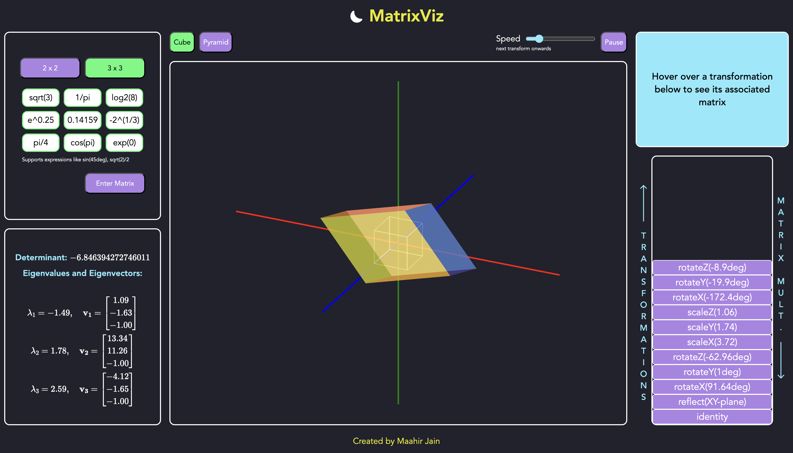

# MatrixViz

A linear algebra tool that identifies linear transformations associated with any 3 x 3 or 2 x 2 matrix, and creates an interactive animation displaying the transformations.

## [Live Preview](https://maahirjain.github.io/matrix-viz/)
Visit at [maahirjain.github.io/matrix-viz](https://maahirjain.github.io/matrix-viz/).




## Features
- Computes a series of linear transformations associated with the input matrix from rotations, scaling, reflections, shears, and projections 
- Generates and displays an animation showing each linear transformation applied on the starting shape until the final effect of the matrix on the shape is seen 
- Includes controls for the speed of the animation and to pause and play the ongoing animation 
- Includes animations for 4 shapes - cube, pyramid, square and triangle
- Allows interactivity with the 3D graph to change the view of the animation 
- Displays the matrix associated with each linear transform 
- Accepts 2 x 2 and 3 x 3 matrices with support for math expression inputs such as sin(45deg) and sqrt(2)/2 
- Displays the determinant, eigenvalues and corresponding eigenvectors of the input matrix, using MathJax 
- Has both dark mode and light mode options 
- Shows an outline of the initial shape showing a visual comparison between the starting and end result 
- Implements form validation checks to ensure an input matrix is valid 
- Stores 3D transform data across various interactions 
- Responsive to various devices 

## Documentation
You can access TypeDoc documentation for the project [here](https://maahirjain.github.io/matrix-viz/docs/).

## Behind the Scenes
Here is a sketch of how the linear transformations associated with the input matrix are computed:

The input matrix is first compared against some common matrix forms associated with scaling, shears, reflections, and projections – specifically, the following, where $*$ represents any real number.

### 2 x 2
```math
  \begin{bmatrix} 
    * & 0 \\ 
    0 & * 
  \end{bmatrix},
  \quad
  \begin{bmatrix} 
    1 & * \\ 
    * & 1 
  \end{bmatrix}
```

### 3 x 3
```math
  \begin{bmatrix} 
    * & 0 & 0 \\ 
    0 & * & 0 \\
    0 & 0 & *
  \end{bmatrix},
  \quad
  \begin{bmatrix} 
    1 & * & 0 \\ 
    * & 1 & 0 \\
    0 & 0 & 0
  \end{bmatrix}
```

If the input matrix $M$ is not in one of these forms, its [singular value decomposition](https://en.wikipedia.org/wiki/Singular_value_decomposition) $M = U\Sigma V^T$ is computed.

We know that $\Sigma$ is a diagonal matrix and hence represents the product of a scaleX, scaleY, and scaleZ matrix.

$U$ and $V^T$ are orthogonal, and it is known that every orthogonal matrix can be expressed as a product of rotation and reflection matrices. We find a decomposition of $U$ and $V^T$ into rotation and reflection matrices, as follows.

The determinant of an orthogonal matrix $Q$ is $\pm 1$ – if it is $1$, it represents a _proper_ rotation, and if it is $-1$, it represents a reflection followed by a _proper_ rotation.

Thus, if $\det(Q) = 1$, we can decompose $Q$ into rotateX, rotateY, and rotateZ matrices by [computing Euler angles](https://eecs.qmul.ac.uk/%7Egslabaugh/publications/euler.pdf). 

If $\det(Q) = -1$, we can decompose $Q = (QR)R$ where 
```math
  R =  
  \begin{bmatrix} 
    1 & 0 & 0 \\ 
    0 & 1 & 0 \\
    0 & 0 & -1
  \end{bmatrix}
```
which represents a reflection with respect to the $XY$-plane. We have $(QR)^T = R^TQ^T = R^{-1}Q^{-1}$ and $\det(QR) = \det(Q)\det(R) = -1 \cdot -1 = 1$. Hence, $QR$ represents a proper rotation and can be decomposed as above.


